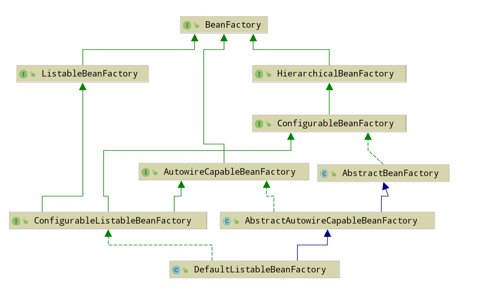

ioc 容器初始化可分为：bean的定位，载入，注册
预备知识：
重要组件
>org.springframework.beans.factory.BeanFactory
>org.springframework.context.ApplicationContext
>org.springframework.beans.factory.xml.DefaultBeanDefinitionDocumentReader：document对象转为BeanDefinition对象

重要组件详细说明：
1 BeanFactory：统一创建对象，为开发者管理对象间的依赖关系提供便利和基础服务。
BeanFactory类层次关系图

从上图中我们可以发现最终的默认实现类是 DefaultListableBeanFactory，他实现了所有的接口。
其他BeanFactory说明：
ListableBeanFactory：产生的 Bean 是可列表的。
HierarchicalBeanFactory：产生的Bean 是有继承关系的，也就是每个Bean 有可能有父 Bean。
AutowireCapableBeanFactory：产生的Bean 有自动装配规则。

2 ApplicationContext：具有BeanFactory全部功能，相当于ApplicationContext 是BeanFactory的上司，对外提供服务的时候，一般通过ApplicationContext获取。
3 BeanDefinition：Bean对象

定位：把定义的资源文件设置
org.springframework.context.support.AbstractRefreshableConfigApplicationContext.setConfigLocation：对Bean定义资源文件的定位
org.springframework.beans.factory.xml.XmlBeanDefinitionReader.loadBeanDefinitions(org.springframework.core.io.support.EncodedResource)
org.springframework.beans.factory.xml.DefaultDocumentLoader.loadDocument

载入：把定义的资源文件转为Document对象，把Document对象转为BeanDefinition对象
org.springframework.beans.factory.xml.DefaultDocumentLoader.loadDocument
按照Spring的Bean规则对Document对象解析的过程是在DefaultBeanDefinitionDocumentReader中实现的，DefaultBeanDefinitionDocumentReader对Document对象进行解析
org.springframework.beans.factory.xml.DefaultBeanDefinitionDocumentReader.importBeanDefinitionResource 解析import标签

注册：把BeanDefinition对象放到注册中心
注册入口：
>org.springframework.beans.factory.xml.DefaultBeanDefinitionDocumentReader.processBeanDefinition
  >org.springframework.beans.factory.support.BeanDefinitionReaderUtils.registerBeanDefinition

